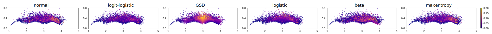
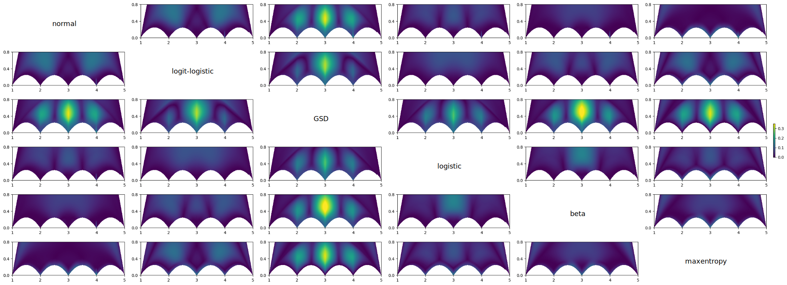

# Supplemental material for the paper "Maximum entropy and quantized metric models for absolute category ratings"
Dietmar Saupe, Krzysztof Rusek, David Hägele, Daniel Weiskopf, Lucjan Janowski

---

In this supplemental material we provide more details on the models that we evaluated in the main document as well as the source code used to compute the models.

## Files and references that should be cited for their usage
- **ACR_Modeling.m** Matlab code. Please cite paper Saupe, D., Rusek, K., Hägele, D., Weiskopf, D., & Janowski, L., Maximum entropy and quantized metric models for absolute category ratings, IEEE Signal Processing Letters 31 (2024) p. 2970-2974.
- **KonIQ-10k.csv**, ACR dataset. Please cite paper Hosu, V., Lin, H., Sziranyi, T., & Saupe, D., KonIQ-10k: An ecologically valid database for deep learning of blind image quality assessment, IEEE Transactions on Image Processing 29 (2020) p. 4041-4056.
- **VQEG-HDTV.csv**, ACR dataset. Please cite Video Quality Experts Group, Report on the validation of video quality models for high definition video content, https://vqeg.org/projects/hdtv/.
- **gsd_prob_vectors.csv**, dataset of GSD distributions. Please cite Nawała, J., Janowski, L., Ćmiel, B., Rusek, K., & Pérez, P., Generalized score distribution: A two-parameter discrete distribution accurately describing responses from quality of experience subjective experiments, IEEE Transactions on Multimedia 25 (2022) p. 6090-6104.

## Code
The code is given in the form of a single Matlab file ACR_Modeling.m. The program reads either one of the two datasets KonIQ-10k or VQEG-HDTV and then computes the maximum entropy and quantized metric models for all the ACR distributions in the datasets. This reproduces (among other things) the values in the columns for AIC and G-test in Tables I and II of the paper. The user can selects the dataset (KonIQ-10k or VQEG-HDTV) in the code and also which one of the distribution types shall be taken into account. The program produces as output a protocol that lists the progress of the processing, and at the end produces a figure and an output Excel file. The file contains for each stimulus in the dataset the stimulus-id, the ACR ratings, the model name, the model parameter values, the model probabilities for the 5 quality categories, the negative log likelihood, the gtest value, and the p-value correspondimng to the g-test, based on the chisquare distribution.

## Model Comparison
In the main document, an evaluation of the different models is given where their goodness of fit is determined and prediction accuracy is measured with respect to the *VQEG HDTV* and *KonIQ-10k* datasets.
Here, we provide a visual comparison of the models and give more details on their individual performance.

### Comparison of G-Test Results with Datasets
To get a more detailed impression of the models' performances, we have a look at the plane of $\Psi$ (*mean opinion score*) and $v$  (*variance*).
We use the *VQEG HDTV* and *KonIQ-10k* datasets to create a scatter plot of the stimuli's $\Psi$ and $v$ and color code them by their G-test value of the respective model.

|  |
| --- |
| *Figure 1* - Scatterplots for the different models showing $\Psi$ and $v$ of the stimuli of the *VQEG HDTV* dataset. The corresponding G-test values are visualized by color. |

In Figure 1, it can be seen that all models expose similar patterns. 
The points on the sides of the plots, i.e., those corresponding to stimuli with little or high mean opinion score and smaller possible variance, have small G-test values (blue color) and are better fitted by the models.
Stimuli located more toward the center tend to be fitted worse by the models.
For this dataset (*VQEG HDTV*), all models look equally valid.

|  |
| --- |
| *Figure 2* - Scatterplots for the different models showing $\Psi$ and $v$ of the stimuli of the *KonIQ-10k* dataset. The corresponding G-test values are visualized by color. |

In Figure 2, the same kind of visualization is used, but with the *KonIQ-10k* dataset, which contains a considerably larger number of stimuli.
Here, the models show clearly different patterns.
For example, the GSD model has high G-tests values for stimuli close to $\Psi=3$, whereas other models, like normal, beta, and maxentropy, show high G-test values for stimuli between $\Psi=3$ and $\Psi=4$.
The plot for the logit-logistic model has the lowest G-test values for this dataset, which resonates with our findings reported in the main document. 

### Comparison of ACR Probability Vector Outputs
While the above plots showed the models' performance on two different datasets, we also want to give some details on the general similarity of the model outputs.
Therefore, we have a look at the ACR probability vectors generated for different inputs of $\Psi$ and $v$.
To compare the models to each other, we compute the difference of the output vectors of all model pairings.
The resulting pairwise distance fields are then shown in a plot matrix. 

|  |
| --- |
| *Figure 3* - Pairwise comparison of the models ACR probability vector output. The L1-distance of the output vectors between two models for inputs from the $\Psi$ - $v$ - plane is color-coded. Bright colors indicate areas where the models output differs strongly. On the diagonal of the matrix plot, the model is indicated that is compared in the corresponding row and column. Plots below the diagonal are redundant due to symmetry. | 

In Figure 3 the L1-distance metric was used.
The largest distances can be observed in pairs with GSD, and that the models disagree with GSD most in the center area.
The most similar vector output (w.r.t the L1-distance) is generated by the normal and maxentropy models, as indicated by the large dark areas.
The logit-logistic model and the maxentropy model show low differences in the middle area around $\Psi=3$, whereas other pairings tend to have larger distances in that location.

|  |
| --- |
| *Figure 4* - Pairwise comparison of the models ACR probability vector output. The Aitchison distance of the output vectors between two models for inputs from the $\Psi$ - $v$ - plane is color-coded. Bright colors indicate areas where the models output differs strongly. On the diagonal of the matrix plot, the model is indicated that is compared in the corresponding row and column. Plots below the diagonal are redundant due to symmetry. |

Since the ACR probability vectors are compositions, i.e., their values are non-negative and sum up to $1$, we used the Aitchison distance as a second metric, that is intended for composional data analysis and captures the differences of the probability ratios.
This metric is shown in Figure 4 and gives patterns that differ from those visible with the L1-distance.
What is expecially noticable is that the largest differences can be observed in regions with little varaince close to $\Psi=2$ and $\Psi=4$.
The interpretation of this is that the ratios of the probability vectors differ more strongly there, however, the differening entries must be small due to the little variance, and the difference stems from the order of magnitude of the small entries (e.g. probability of $10^{-5}$ vs. $10^{-8}$), which may be neglectable in practice.
The most similar models in this comparison are normal and beta, as well as logistic and logit-logistic.

