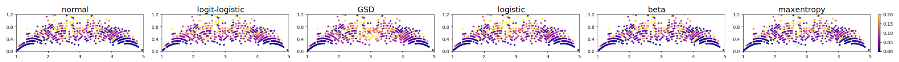
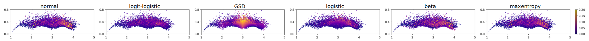
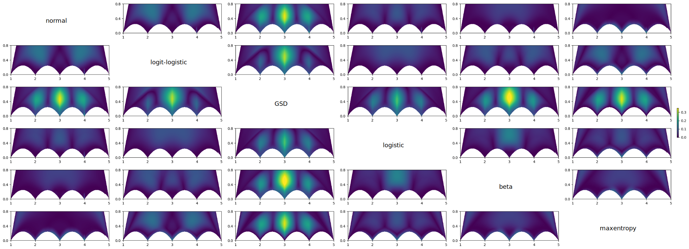
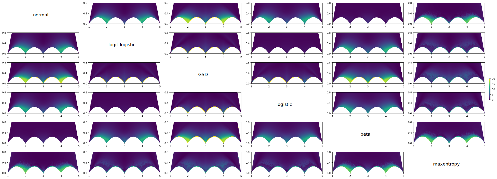

# Model Comparison
In the main document an evaluation of the different models is given where their goodness of fit is determined and predction accuracy is measured with respect to the *VQEG* and *KonIQ-10k* dataset.
Here, we provide a visual comparison of the models and give more details on how they compare to each other.

## Comparison with Data Sets
To get a more detailed impression of the models performances, we have a look at the plane of $\Psi$ (*mean opinion score*) and $v$  (*variance*).
We use the *VQEG* and *KonIQ-10k* dataset to create a scatter plot of the stimuli's $\Psi$ and $v$ and color code them by their G-test value of the respective model.

|  |
| --- |
| *Figure 1* - Scatterplots for the different models showing $\Psi$ and $v$ of the stimuli of the *VQEG* data set and corresponding G-test value as color. |

more text

|  |
| --- |
| *Figure 2* - Scatterplots for the different models showing $\Psi$ and $v$ of the stimuli of the *KonIQ-10k* data set and corresponding G-test value as color. |

## Comparison of ACR Output

and even more

